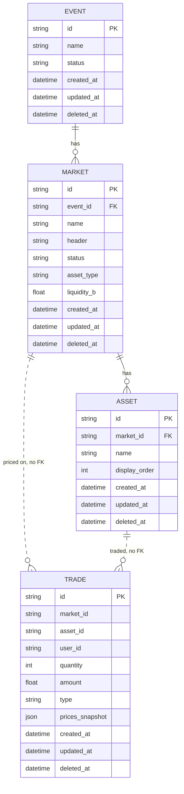
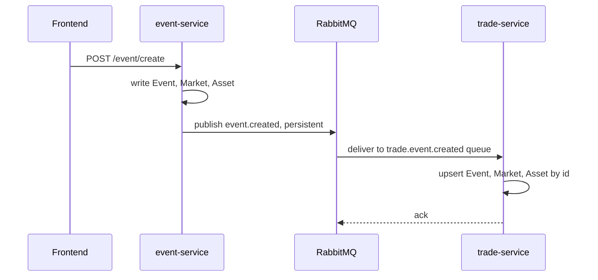
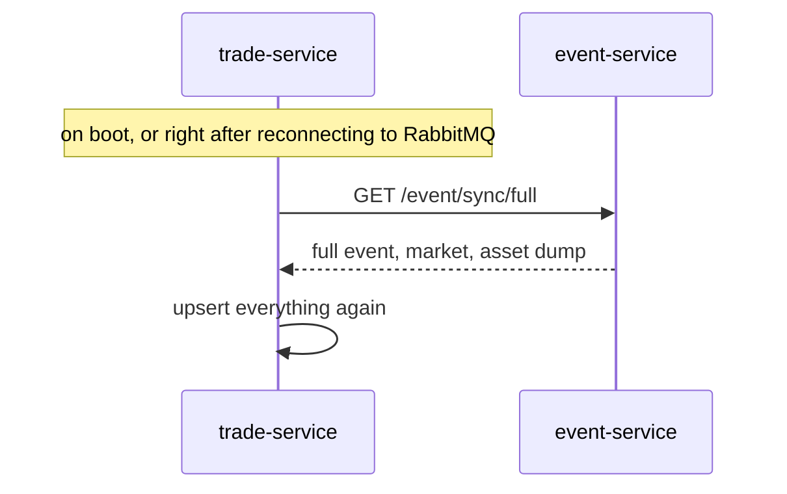

# prediction-market-event-service

Owns the event and market data for Prediction Market. Handles creating and reading
`Event -> Market -> Asset` (for example: "Will France win the World Cup?" leads to
"France vs Brazil" leads to "France" / "Brazil"), and publishes changes to RabbitMQ so
trade-service can keep its own synced copy up to date.

Built with [Hono](https://hono.dev/) and [Prisma](https://www.prisma.io/) (Postgres).

## Design

This project is split into two backend services on purpose, each owning its own data:

- **event-service** (this repo) is the source of truth for `Event`, `Market`, and
  `Asset`. Nothing else is allowed to write to these tables directly.
- **trade-service** owns `Trade` and keeps a local, read-only copy of
  `Event` / `Market` / `Asset`, synced from this service. It needs that data to price
  and validate trades, but doesn't own it, so it never writes to it directly either.

The two services don't share a database and don't call each other on the request
path. The only link between them is RabbitMQ, plus one REST endpoint used for
catch-up sync. This is meant to mirror how real microservices are usually split:
by data ownership, not by technical layer.

## How the services communicate

When an event is created here, the full nested result (event, markets, assets) is
published to a durable topic exchange (`event.exchange`) as a persistent message.
trade-service has its own durable queue bound to that exchange, and its consumer
upserts the data by id, which makes replaying the same message twice harmless.

There's no synchronous call from event-service to trade-service, ever. The only
synchronous call in the other direction is trade-service's reconciliation pull
(`GET /event/sync/full`, below), and that only happens when trade-service boots or
reconnects to RabbitMQ, not on every request. Day to day, the two services only talk
through the queue.

## Services and tools used

- [Hono](https://hono.dev/) for the HTTP API
- [Prisma](https://www.prisma.io/) with Postgres for storage
- RabbitMQ as the message broker between the two backend services
- Hosted on [Render](https://render.com/)

## Data model

`Event`, `Market`, and `Asset` are owned here. trade-service keeps a synced copy of
the same three tables plus its own `Trade` table, which is why `Trade` shows up below
with no enforced foreign key to `Market` or `Asset`, those relations only exist on the
trade-service side of the sync.



## Core flows

**Creating an event and syncing it to trade-service:**



**Catching up after downtime (trade-service restart, or a RabbitMQ outage):**



Because the upsert is keyed by id, running it again with data trade-service already
has is a no-op. This is what makes the reconciliation pull safe to run on every
reconnect instead of trying to track exactly what was missed.

## Known limitations

**`/event/sync/full` does not scale past a certain data size.** It returns every
event, market, and asset in one unpaginated response, and trade-service calls it in
full on every boot and every RabbitMQ reconnect. That is fine for a small dataset, but
once there are thousands of events with their nested markets and assets, this endpoint
will get slow, and most of what it sends back on any given call never actually
changed since the last sync.

Planned fix: an incremental version of this endpoint, for example filtering by
`updated_at` or a cursor, so trade-service only has to pull what changed since its
last successful sync instead of the entire dataset every time. Not fixed yet, noting
it here so it is a known tradeoff and not a silent gap.

**`/event/sync/full` is not private.** There is no auth on it, anyone who knows the
URL can pull a full dump of every event, market, and asset. This was a quick way to
get the reconciliation flow working for a prototype, not a decision meant to hold up
outside of one. Planned fix: some form of service-to-service auth (a shared secret
header at minimum) before this is exposed to real traffic.

## Endpoints

- `POST /event/create` - create an event with its markets and assets
- `GET /event/list` - paginated list of events
- `GET /event/details?id=` - one event with its markets/assets
- `GET /event/sync/full` - full, unpaginated dump used by trade-service to
  reconcile its shadow tables on (re)connect

## Running

```
npm install
npm run dev
```

Runs on `http://localhost:3001` by default (configurable via `PORT`). Requires
`DATABASE_URL` and `RABBITMQ_URL` in `.env`.
